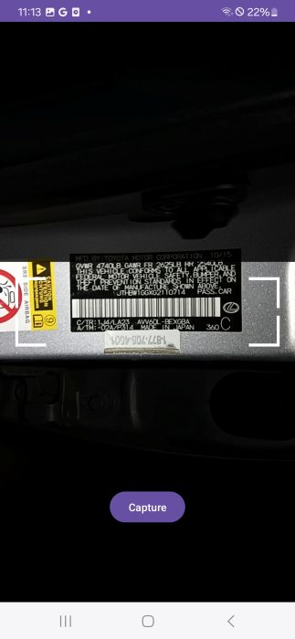
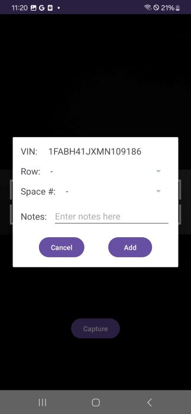
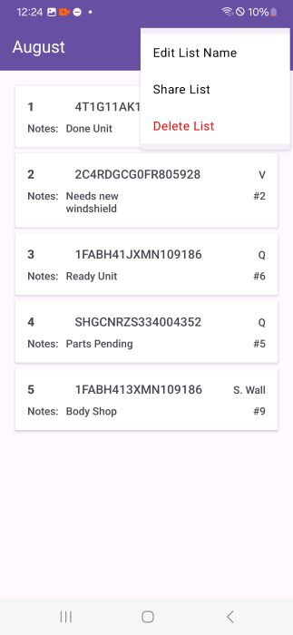

VinScanner AI

An intelligent application that streamlines automotive inventory management through real-time VIN detection and automated data collection.

Overview:
VIN Scanner AI uses computer vision and Google ML Kit's OCR to automatically detect and extract VIN numbers from vehicle windshields using 
your device's camera. The app allows users to build comprehensive vehicle lists with custom notes, location data, and repair status—all 
exportable as CSV files for seamless sharing via email.

Built for: 
Automotive inventory management, repair shops, and dealership operations

Key Features:
- Real-Time VIN Detection: Scan VINs and VIN-barcodes directly from windshields using ML Kit OCR
- Custom Data Entry: Add notes, location information, and repair status to each VIN
- Editable Lists: Manage and organize scanned VINs with full editing capabilities
- CSV Export: Generate shareable spreadsheets with all collected data
- Email Integration: Attach CSV files directly to your device's email app
- Offline Capable: Works without internet connection for on-site inventory collection

Tech Stack:
- Language: Java
- Platform: Android
- ML/AI: Google ML Kit (Text Recognition)
- Architecture: MVVM pattern
- Data Export: Apache Commons CSV

Use Cases:
- Quickly inventory vehicles on a lot
- Track repair progress with notes and status updates
- Document vehicle locations for large facilities
- Export organized data for spreadsheet analysis
- Reduce manual data entry errors

## Screenshots
 

## 🎥 Demo Video

